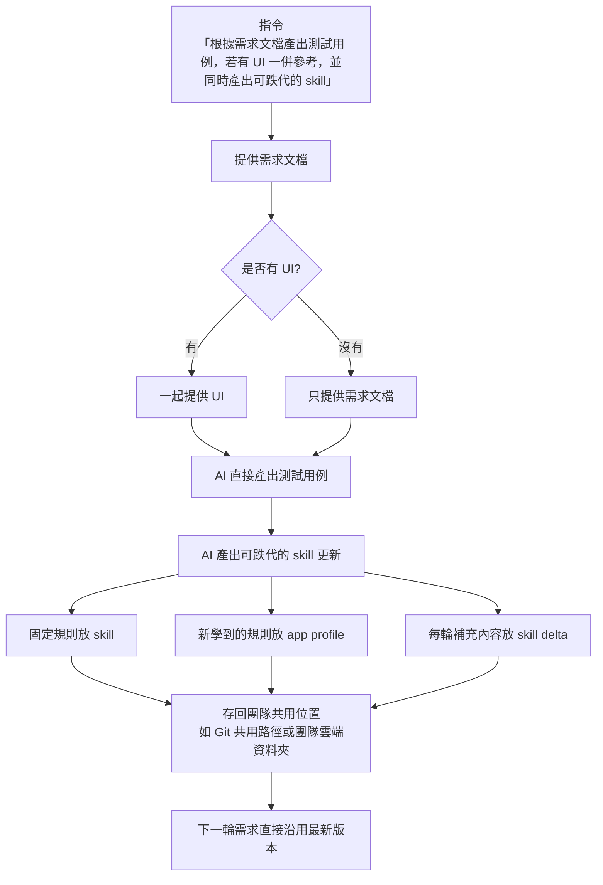

# 如何使用跌代的 Skill

## abstract
此篇文章引導測試組員如何使用現有的 Skill 產出測試用例，並同時產出可跌代的 Skill。流程保持簡單：組員只要提供需求文檔，若有 UI 也一併提供，AI 就會直接產出可執行的 Google Sheet 測試用例，以及可供下一輪使用的 Skill 更新內容。

## method
1. 在 IDE 或 VS Code 中安裝 GitHub Copilot。
2. 將可跌代的 Skill 放入團隊共用資料夾，例如專案中的 `.github/skills/` 路徑。
3. 當有需求時，直接把需求文檔餵給 AI。
4. 若有 UI 設計圖、截圖或畫面說明，也一併提供給 AI；若沒有 UI，可以不提供。
5. 讓 AI 直接產出兩個結果：
   - 可執行的 Google Sheet 測試用例
   - 可跌代的 Skill 更新內容
6. 將產出的 Skill 更新回存到團隊共用位置，供下一次需求使用。
7. 下一輪只需要再提供新的需求文檔與 UI，重複相同流程即可。

## 操作原則
- 流程不需要額外中間審核步驟。
- 只有需求文檔是必填，UI 是選填。
- 產出的測試用例必須可以直接貼到 Google Sheet 使用。
- 產出的 Skill 必須能保留本次學到的 app 規則，讓下一輪更準確。

## 語句範例

### 1. 基本指令
- 讀需求文檔、產出測試用例並同時更新跌代的 Skill。
- 請根據我提供的需求文檔與 UI，直接產出可執行的 Google Sheet 測試用例，並產出下一輪可跌代的 Skill。
- 這一輪只需要需求文檔，如果有 UI 我會一起提供，請直接開始產出測試用例與 Skill 更新。

### 2. 給 AI 的完整說法
- 請先閱讀這份需求文檔，若有 UI 也一起參考，然後直接產出測試用例與可跌代的 Skill，不需要額外流程。
- 請用需求文檔加上 UI 直接生成 Google Sheet 測試用例，並把這次學到的 app 規則整理成下一輪可使用的 Skill。
- 請把需求文檔中確認的功能、例外與邊界條件寫進測試用例，並同步更新 Skill，方便下次迭代。

### 3. 給測試組員的簡短口令
- 讀需求，給 UI，出用例，出 Skill。
- 有 UI 就附 UI，沒有就只給需求。
- 產出用例後，把 Skill 一起存回去。

### 4. 迭代時可用的指令
- 請根據上一輪的 Skill 與這次的新需求，更新測試用例與 Skill。
- 請把這次需求學到的新規則加回 Skill，並產出下一輪可直接使用的測試用例。
- 請保留已確認的 app 行為，補上這次新學到的內容，形成下一版 Skill。

## 建議流程圖
1. 組員提供需求文檔。
2. 若有 UI，就一起提供 UI；若沒有 UI，就只提供需求文檔。
3. AI 直接產出測試用例。
4. AI 同時產出可跌代的 Skill。
5. 將 Skill 存回團隊共用位置。
6. 下一輪直接沿用新的 Skill。

## 流程說明
- UI 是選填，不提供也可以直接產出測試用例與 Skill。
- 組員只需要把需求文檔餵給 AI；如果有 UI，就一起附上。
- AI 的輸出只有兩個重點：測試用例和可跌代的 Skill。

## 簡化版

| 步驟 | 說明 |
|---|---|
| 1 | 提供需求文檔 |
| 2 | UI 有就一起提供，沒有就略過 |
| 3 | 產出測試用例 |
| 4 | 產出可跌代的 Skill |
| 5 | 存回團隊共用位置，供下一輪使用 |

## 建議流程圖

```mermaid
flowchart TD
	A[组员第一句指令<br/>请根据这份需求文档产出测试用例<br/>若有 UI 也一并参考<br/>并同时产出可跌代的 skill]
	B[提供需求文档]
	C{是否有 UI?}
	D[一起提供 UI]
	E[只提供需求文档]
	F[AI 产出测试用例<br/>TEST_CASES_KLINE_180.md<br/>Google Sheets-ready 中文格式]
	G[AI 产出可跌代的 skill 更新]
	H[固定规则放 SKILL_NEW.md]
	I[新学到的规则放 APP_PROFILE.md]
	J[每轮补充内容放 SKILL_DELTA.md]
	K[第二句追问<br/>把 SKILL_DELTA.md 里已经稳定的规则<br/>正式合并回 SKILL_NEW.md]
	L[AI 合并稳定规则回主 skill<br/>更新 SKILL_NEW.md]
	M[第三句追问<br/>把 TEST_CASES_KLINE_180.md<br/>整理成 Excel 最终交付格式]
	N[AI 产出 Excel 交付版<br/>TEST_CASES_KLINE_180_EXCEL.md<br/>栏位: 模块 | 標題 | Precondition | 步驟 | 驗證 | 備註]
	O[存回团队共用位置<br/>如 Git 共用路径或团队云端资料夹]
	P[下一轮需求直接沿用最新版本]

	A --> B
	B --> C
	C -- 有 --> D
	C -- 没有 --> E
	D --> F
	E --> F
	F --> G
	G --> H
	G --> I
	G --> J
	H --> K
	I --> O
	J --> K
	K --> L
	F --> M
	M --> N
	L --> O
	N --> O
	O --> P
```

## 落地建議
- 將 Skill 放在團隊共用的版本控管位置，方便所有測試組員一起使用。
- 每次迭代後都保留一份最新 Skill，避免不同成員使用不同版本。
- 測試用例與 Skill 一起更新，讓知識累積在同一條流程內。
