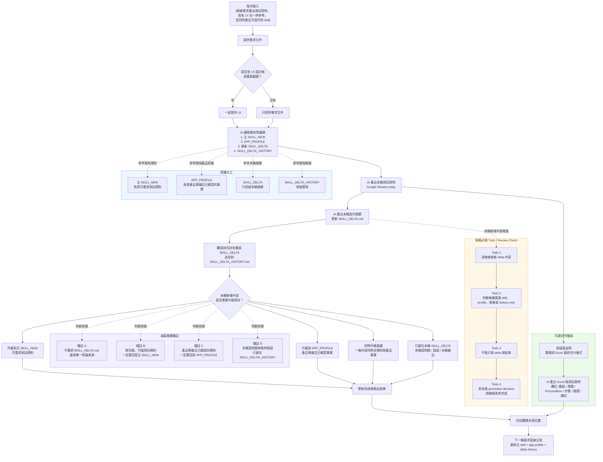

```mermaid
flowchart TD
    A["指令輸入<br/>[根據需求產出測試用例，<br/>若有 UI 也一併參考，<br/>並同時產出可迭代的 skill]"]
    B["提供需求文件"]
    C{"是否有 UI 設計稿<br/>或畫面截圖？"}
    D["一起提供 UI"]
    E["只提供需求文件"]

    F["AI 讀取既有知識庫<br/>1. 主 SKILL_NEW<br/>2. APP_PROFILE<br/>3. 最新 SKILL_DELTA<br/>4. SKILL_DELTA_HISTORY"]
    G["AI 產出本輪測試用例<br/>Google Sheets-ready"]
    H["AI 產出本輪迭代摘要<br/>更新 SKILL_DELTA.md"]

    I{"本輪新增內容<br/>是否需要升級保存？"}
    J["升級到主 SKILL_NEW<br/>可重用測試規則"]
    K["升級到 APP_PROFILE<br/>產品專屬且已確認事實"]
    L["同時升級兩邊<br/>一條內容同時含規則與產品事實"]
    M["只留在本輪 SKILL_DELTA<br/>未確認問題 / 假設 / 本輪備註"]

    N["覆寫前先封存舊版 SKILL_DELTA<br/>追加到 SKILL_DELTA_HISTORY.md"]
    O["更新完成後輸出結果"]
    P["存回團隊共用位置"]
    Q["下一輪需求直接沿用<br/>最新主 skill + app profile + delta history"]

    subgraph KNOWLEDGE["知識分工"]
        KS["主 SKILL_NEW<br/>負責可重用測試規則"]
        KP["APP_PROFILE<br/>負責產品專屬且已確認的事實"]
        KD["SKILL_DELTA<br/>只保留本輪摘要"]
        KH["SKILL_DELTA_HISTORY<br/>保留歷程"]
    end

    subgraph TODO_REVIEW["每輪必做 Todo / Review Check"]
        T1["Todo 1<br/>逐條檢查新 delta 內容"]
        T2["Todo 2<br/>判斷每條要進 skill、profile、兩者或 history only"]
        T3["Todo 3<br/>不能只寫 delta 就結束"]
        T4["Todo 4<br/>若未做 promotion decision<br/>該輪視為未完成"]
    end

    subgraph NOTE_TEAM["組員閱讀備註"]
        R1["備註 A<br/>不要把 SKILL_DELTA.md 當成唯一知識來源"]
        R2["備註 B<br/>跨功能、可複用的規則<br/>一定要回寫主 SKILL_NEW"]
        R3["備註 C<br/>產品專屬且已確認的規則<br/>一定要回寫 APP_PROFILE"]
        R4["備註 D<br/>未確認問題與暫時假設<br/>只留在 SKILL_DELTA/_HISTORY"]
    end

    subgraph OPTIONAL_EXCEL["可選交付階段"]
        X1["若組員追問<br/>整理成 Excel 最終交付格式"]
        X2["AI 產出 Excel 版測試案例<br/>欄位: 模組 / 標題 / Precondition / 步驟 / 驗證 / 備註"]
    end

    A --> B
    B --> C
    C -- 有 --> D
    C -- 沒有 --> E
    D --> F
    E --> F
    F --> G
    G --> H
    H --> N
    N --> I

    I --> J
    I --> K
    I --> L
    I --> M

    J --> O
    K --> O
    L --> O
    M --> O

    O --> P
    P --> Q

    F -. 參考既有規則 .-> KS
    F -. 參考既有產品知識 .-> KP
    F -. 參考本輪摘要 .-> KD
    F -. 參考歷程脈絡 .-> KH

    H -. 本輪新增內容檢查 .-> T1
    T1 --> T2
    T2 --> T3
    T3 --> T4

    I -. 判斷依據 .-> R1
    I -. 判斷依據 .-> R2
    I -. 判斷依據 .-> R3
    I -. 判斷依據 .-> R4

    G --> X1
    X1 --> X2
    X2 --> P

    style KNOWLEDGE fill:#eef6ff,stroke:#7aa6d8,stroke-width:1px,color:#12344d
    style TODO_REVIEW fill:#fff7e6,stroke:#e0b84f,stroke-width:1px,color:#5c4400
    style NOTE_TEAM fill:#f3f0ff,stroke:#9a86d1,stroke-width:1px,color:#33235c
    style OPTIONAL_EXCEL fill:#eafbea,stroke:#7bc47f,stroke-width:1px,color:#173d1a
```
