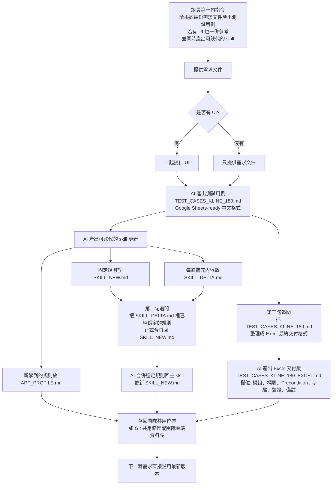

# 一通金業 180 版本需求（K線一期）測試用例 - Excel格式

## 建議操作流程 Prompt

### Prompt 1：首輪生成
- 請根據這份需求文件產出測試用例，若有 UI 也一併參考，並同時產出可跌代的 skill。

### Prompt 2：穩定規則正式回寫主 Skill
- 我直接把 SKILL_DELTA.md 裡已經穩定的規則，正式合併回 SKILL_NEW.md。

### Prompt 3：交付版 Excel 用例整理
- 我把 TEST_CASES_KLINE_180.md 再整理成你們 Excel 最終交付格式 [模組 | 標題 | Precondition | 步驟 | 驗證 | 備註]。

## Mermaid 流程圖

## 流程說明
- 第一輪輸入是需求文件，可選再加 UI。
- 第一輪固定產出三類內容：測試用例、APP_PROFILE、SKILL_DELTA。
- 如果這一輪的 delta 已經出現穩定且可復用的規則，再用第二句 prompt 觸發主 skill 升級，正式回寫到 SKILL_NEW。
- 如果要給測試組或業務方交付 Excel 版，再用第三句 prompt 把 Google Sheets 版測試用例轉成最終 Excel 欄位格式。
- 團隊共享時，固定規則、App 記憶、每輪 delta、交付用例都要一起存回共用位置，下一輪直接復用。

## 輸出格式
- 欄位順序：模組 | 標題 | Precondition | 步驟 | 驗證 | 備註
- 備註欄統一帶出優先級與初始執行結果。

| 模块 | 標題 | Precondition | 步驟 | 驗證 | 備註 |
|---|---|---|---|---|---|
| 拖动止盈止损 | 单笔持仓-点击持仓线进入编辑态 | 当前品种存在1笔持仓 | 1. 打开K线页；2. 点击当前持仓线 | 持仓线由虚线变实线，并显示止盈止损拖动按钮 | 优先级:P1；结果:Not Run |
| 拖动止盈止损 | 单笔持仓-首次设置止盈 | 当前品种存在1笔持仓，且进入编辑态 | 1. 向有效止盈区域拖动按钮；2. 松手 | 弹出止盈止损确认信息，显示目标价与预计盈利/亏损 | 优先级:P1；结果:Not Run |
| 拖动止盈止损 | 单笔持仓-首次设置止损 | 当前品种存在1笔持仓，且进入编辑态 | 1. 向有效止损区域拖动按钮；2. 松手 | 弹出止盈止损确认信息，显示目标价与预计盈利/亏损 | 优先级:P1；结果:Not Run |
| 拖动止盈止损 | 止盈止损-买单方向范围校验 | 已创建买单持仓 | 1. 拖动止盈到小于等于当前卖出价；2. 拖动止损到大于等于当前卖出价 | 系统阻止拖动到无效区域，并提示原因 | 优先级:P1；结果:Not Run |
| 拖动止盈止损 | 止盈止损-卖单方向范围校验 | 已创建卖单持仓 | 1. 拖动止盈到大于等于当前买入价；2. 拖动止损到小于等于当前买入价 | 系统阻止拖动到无效区域，并提示原因 | 优先级:P1；结果:Not Run |
| 拖动止盈止损 | 止盈止损-仅支持按价格设置 | 当前品种存在可操作持仓 | 1. 进入拖动止盈止损流程；2. 查看设置方式 | 仅支持按价格设置，不出现按点数拖动入口 | 优先级:P1；结果:Not Run |
| 拖动止盈止损 | 止盈止损-删除止盈不影响止损 | 持仓已同时设置止盈止损 | 1. 删除止盈；2. 查看止损 | 止盈数据删除成功，止损线仍保留且可继续使用 | 优先级:P1；结果:Not Run |
| 拖动止盈止损 | 止盈止损-删除失败恢复状态 | 持仓已设置止盈或止损 | 1. 点击删除；2. 模拟删除失败 | 线条恢复实线状态，并提示失败原因 | 优先级:P1；结果:Not Run |
| 拖动止盈止损 | 多笔持仓-默认展示最新一笔 | 同品种创建多笔持仓 | 1. 打开K线页 | 默认只展示最新开仓的一笔持仓线 | 优先级:P1；结果:Not Run |
| 拖动止盈止损 | 多笔持仓-切换选中持仓 | 同品种存在多笔持仓 | 1. 打开底部持仓列表；2. 选择另一笔订单 | 图表切换展示所选持仓的开仓线和止盈止损线，上一笔退出可视状态 | 优先级:P1；结果:Not Run |
| 拖动止盈止损 | 休市期间禁止设置止盈止损 | 产品进入休市 | 1. 尝试拖动设置止盈止损 | 系统禁止操作，并提示休市不可设置或修改 | 优先级:P1；结果:Not Run |
| 拖动止盈止损 | 超时提示校验 | 当前品种存在可操作持仓 | 1. 拖动后提交修改；2. 模拟请求超过5秒 | 提示“网络超时，请重试”，且图表状态不被错误更新 | 优先级:P1；结果:Not Run |
| 拖动止盈止损 | 断网提示校验 | 当前品种存在可操作持仓 | 1. 拖动后提交修改；2. 模拟网络断开 | 提示“网络异常”，且图表状态保持原值 | 优先级:P1；结果:Not Run |
| 拖动止盈止损 | 修改过程中订单已平仓 | 当前品种存在可操作持仓 | 1. 拖动止盈止损；2. 同时模拟订单被触发平仓 | Toast提示“订单已平仓”，止盈止损线消失 | 优先级:P1；结果:Not Run |
| 拖动挂单 | 点击K线+新建挂单入口 | 打开K线页且图表可操作 | 1. 点击K线图任意位置；2. 触发十字光标；3. 点击“+” | 弹出新建挂单弹窗，并自动带入当前点击价格 | 优先级:P1；结果:Not Run |
| 拖动挂单 | 新建挂单-默认买入方向 | 已打开新建挂单弹窗 | 1. 查看默认方向 | 默认方向为买入 | 优先级:P1；结果:Not Run |
| 拖动挂单 | 新建挂单-价格范围红字提示 | 已打开新建挂单弹窗 | 1. 输入超范围价格 | 页面出现红字范围提示，且不允许按无效范围提交 | 优先级:P1；结果:Not Run |
| 拖动挂单 | 新建挂单-订单类型自动判断 | 已打开新建挂单弹窗 | 1. 分别输入高于/低于Bid/Ask的价格；2. 查看订单类型 | 系统根据规则自动判断为买入限价/买入停损/卖出限价/卖出停损 | 优先级:P1；结果:Not Run |
| 拖动挂单 | 新建挂单-资金不足不影响挂单 | 可用资金不足 | 1. 提交挂单 | 允许挂单提交，不因可用资金不足而拦截 | 优先级:P1；结果:Not Run |
| 拖动挂单 | 休市期间禁止新建挂单 | 产品进入休市 | 1. 进入新建挂单流程 | 系统禁止新建挂单 | 优先级:P1；结果:Not Run |
| 挂单展示 | 有效挂单-立即显示挂单线 | 挂单提交成功 | 1. 返回K线图查看 | K线图立即显示对应价格的水平挂单线 | 优先级:P1；结果:Not Run |
| 挂单展示 | 挂单线左侧标签格式 | 已提交买/卖挂单 | 1. 查看挂单线标签 | 左侧显示“订单类型 + 买/卖 + 手数”，颜色与买卖按钮一致 | 优先级:P1；结果:Not Run |
| 挂单展示 | 挂单成交后转为持仓线 | 已提交挂单 | 1. 让挂单成交 | 原挂单线消失，并转为当前持仓线 | 优先级:P1；结果:Not Run |
| 挂单展示 | 挂单撤销或过期后消失 | 已提交挂单 | 1. 执行撤销或模拟过期 | 挂单线立即消失 | 优先级:P1；结果:Not Run |
| K线改单 | 拖动挂单线松手后弹出修改订单弹窗 | K线上存在挂单线 | 1. 拖动挂单线到新价格；2. 松手 | 自动弹出修改订单弹窗，价格默认为拖动后新价格 | 优先级:P1；结果:Not Run |
| K线改单 | 点击挂单线标签进入修改面板 | 挂单线已进入编辑态 | 1. 再点击线条标签 | 弹出修改订单面板，默认价格为当前挂单价 | 优先级:P1；结果:Not Run |
| K线改单 | 修改订单-勾选止盈止损后展开设置区 | 已打开修改订单弹窗 | 1. 勾选止盈止损 | 展开设置区域，支持按价格和按点数两种模式 | 优先级:P1；结果:Not Run |
| K线改单 | 修改订单-取消恢复原位置 | 已拖动挂单到新位置并弹窗打开 | 1. 点击取消 | 弹窗关闭，线条恢复到修改前位置 | 优先级:P1；结果:Not Run |
| K线改单 | 修改订单-确认成功 | 已打开修改订单弹窗 | 1. 修改价格或手数；2. 点击确认 | Toast“修改成功”，面板关闭，线条更新到新价位 | 优先级:P1；结果:Not Run |
| K线改单 | 修改订单-失败提示 | 已打开修改订单弹窗 | 1. 输入无效价格或模拟系统超时；2. 点击确认 | 面板保持打开，并显示错误原因或超时提示 | 优先级:P1；结果:Not Run |
| 撤销挂单 | 编辑态点击X触发撤销 | 挂单进入可编辑态 | 1. 点击X | 弹出撤销挂单弹窗或按后台配置直接撤单 | 优先级:P1；结果:Not Run |
| 撤销挂单 | 撤销仅影响当前选中挂单 | 同品种存在多笔挂单 | 1. 切换到某一笔；2. 执行撤单 | 仅当前选中挂单被撤销，其他挂单不受影响 | 优先级:P1；结果:Not Run |
| 撤销挂单 | 挂单已成交后尝试撤销 | 挂单已成交 | 1. 再次执行撤销动作 | 提示“订单已成交，无法撤销”，挂单线消失 | 优先级:P1；结果:Not Run |
| 多笔挂单 | 多笔挂单默认展示最新一笔 | 同品种提交多笔有效挂单 | 1. 打开K线页 | 默认只展示最新提交的一笔挂单线 | 优先级:P1；结果:Not Run |
| 多笔挂单 | 底部挂单列表切换 | 同品种存在多笔挂单 | 1. 打开挂单列表；2. 选择另一笔挂单 | 图表切换展示选中挂单线条，且一次只能操作当前选中挂单 | 优先级:P1；结果:Not Run |
| 持仓挂单共存 | 持仓与挂单同时显示 | 同时存在持仓和挂单 | 1. 打开K线页 | 图表同时显示最新一笔持仓线和最新一笔挂单线 | 优先级:P1；结果:Not Run |
| 持仓挂单共存 | 底部Tab切换列表 | 同时存在持仓和挂单 | 1. 打开底部区域；2. 查看Tab | 可切换“当前持仓”和“当前挂单”两组列表 | 优先级:P1；结果:Not Run |
| 设置 | 默认开关状态校验 | 首次进入设置页 | 1. 查看设置项默认状态 | 当前挂单、当前持仓、现价线默认开启 | 优先级:P1；结果:Not Run |
| 设置 | NEW标签消失规则 | 首次看到NEW标签 | 1. 点击一次对应入口；2. 再次进入 | NEW标签消失，不再显示 | 优先级:P2；结果:Not Run |
| 设置 | 一键开仓后台记忆 | 可进入设置页并修改开关 | 1. 修改一键开仓/订单显示开关；2. 切换app或重进 | 后台返回并恢复上次设置状态 | 优先级:P1；结果:Not Run |
| 一键开仓 | 默认开启校验 | KYC成功后首次进入K线页 | 1. 查看一键开仓状态 | 一键开仓默认开启 | 优先级:P1；结果:Not Run |
| 一键开仓 | 教学引导校验 | KYC成功后首次进入K线页 | 1. 进入K线页面 | 出现一键开仓相关交易教学 | 优先级:P1；结果:Not Run |
| 新手指导 | 首次蒙层触发条件 | 注册成功后首次进入K线页 | 1. 进入K线页 | 首次蒙层引导展示，仅第一次触发 | 优先级:P1；结果:Not Run |
| 新手指导 | 关闭一步后后续不再展示 | 首次蒙层已触发 | 1. 在任一步点击关闭；2. 刷新或再次进入K线页 | 当前及后续引导步骤均不再展示 | 优先级:P1；结果:Not Run |
| 指标 | 主图指标单选规则 | 已存在一个主图指标 | 1. 点击另一个主图指标 | 原主图指标被替换为新选择指标 | 优先级:P2；结果:Not Run |
| 指标 | 副图指标最多两个 | 已可操作副图指标 | 1. 连续选择三个副图指标 | 第三个选中后，第一个副图指标恢复未选中 | 优先级:P2；结果:Not Run |
| K线表 | 切换K线样式 | 已打开K线表 | 1. 分别选择蜡烛图、空心阳线、棒形图、线形图 | 图表样式随选项变化，选中态正确显示 | 优先级:P2；结果:Not Run |
| 十字光标 | 点击图表显示十字光标 | 打开K线页且图表可操作 | 1. 点击K线图任意位置 | 显示十字光标与对应时刻的开高低收、涨跌额、涨跌幅、振幅等数据 | 优先级:P2；结果:Not Run |
| 最高最低线 | 最高/最低线显示规则 | 已开启最高/低线 | 1. 打开K线页 | 显示今日最高/最低价位线 | 优先级:P2；结果:Not Run |
| 横屏 | 横屏拖动止盈止损 | 当前品种存在1笔持仓 | 1. 切换横屏；2. 执行单笔拖动止盈止损 | 横屏下允许正常拖动和确认 | 优先级:P1；结果:Not Run |
| 时间切换 | 分时/日期切换后展示保留 | 已设置可展示内容 | 1. 切换分时或日期 | 只要在设定价格范围内，内容继续展示 | 优先级:P1；结果:Not Run |
| 埋点 | 埋点编码完整触发 | 可抓取埋点日志或上报结果 | 1. 分别执行227-260定义的动作 | 对应埋点事件均被正确触发并上报 | 优先级:P1；结果:Not Run |